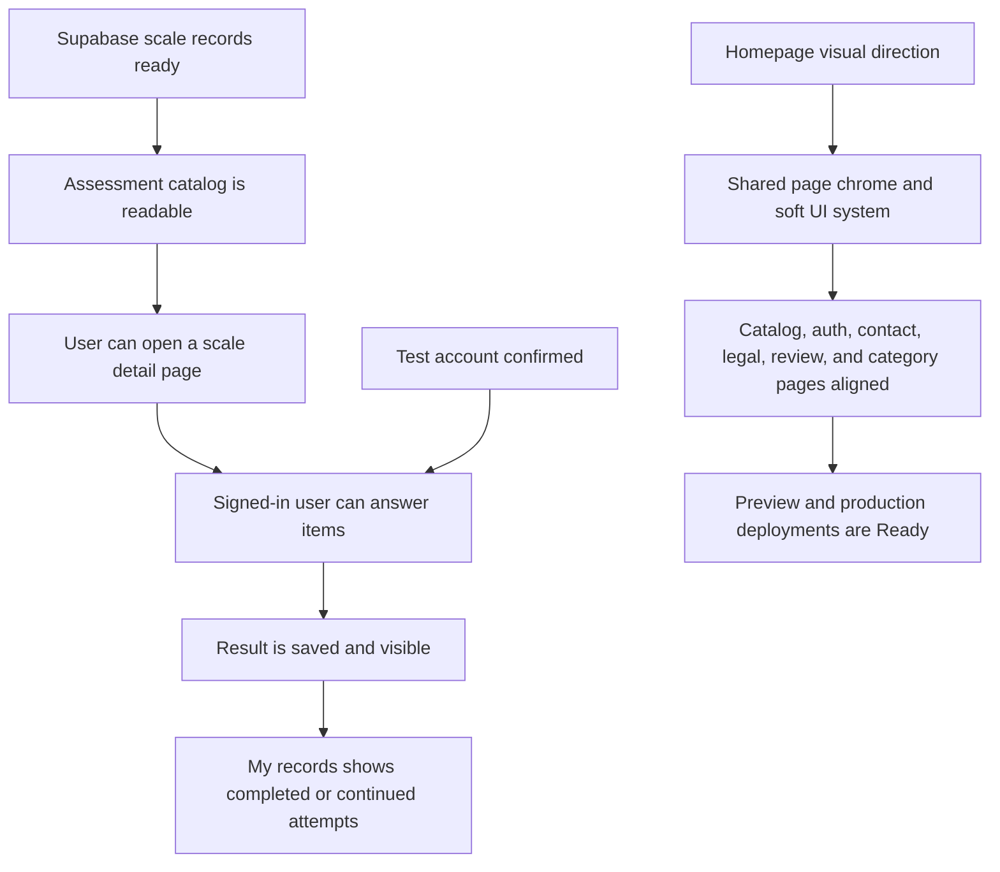

# EQAI Product Brief - 2026-06-07

## Audience and Purpose

- Audience: Product, project owner, reviewer, and implementation handoff readers.
- Purpose: Summarize what changed today, what is now usable in production, how to test it, and what remains risky or undecided.
- Role: Briefing pilot. This document separates confirmed facts, product meaning, open questions, and remaining risk.
- Confidence boundary: Based on local source changes, git commits, Supabase MCP verification, Vercel deployment output, local test output, and browser/CDP checks performed on 2026-06-07.

## Executive Summary

Today moved the EQAI MVP from a partially wired assessment prototype toward a production-reviewable product surface. The work covered database readiness, assessment flow completion, auth navigation, copy cleanup, homepage asset correction, UI alignment across routes, production deployment, and a confirmed test account.

The current production site is available at:

- Production: https://webdeveqai.vercel.app
- Production deployment: https://webdeveqai-7hlcq189p-isidoresongs.vercel.app
- Latest preview deployment: https://webdeveqai-ow3vi2mhq-isidoresongs.vercel.app

Test login:

- Account: `test@eqai.com`
- Login key: `eqai2026`
- Login page: https://webdeveqai.vercel.app/zh/login

## Product State Flow



## What Was Completed

### 1. Database and Supabase Readiness

Confirmed the Supabase MCP path was usable and ran the MVP assessment records SQL. Verified that `assessment_scales` was readable after migration and seed work.

Product meaning: the assessment catalog no longer depends only on local placeholders. It can read the active MVP assessment set from Supabase and support user-owned attempt records.

Evidence:

- `backend/ingestion/mvp_scale_records.sql` was executed earlier in the day.
- `assessment_scales` was verified readable.
- Smoke tests later confirmed authenticated attempt writes.

### 2. Assessment Flow Completion

Fixed the core assessment journey:

- Catalog routes display active assessments.
- Detail pages explain the non-diagnostic boundary.
- Signed-in users can start an attempt.
- Users can answer 1-7 scale items.
- Submitting saves the result instead of hanging.
- Result pages show total score, average score, completed time, answer count, and dimension summaries.
- My Records shows started attempts with continue actions and completed attempts with result actions.

Product meaning: the MVP now supports a real end-to-end loop rather than only assessment discovery.

### 3. Auth and Navigation Behavior

Updated navigation so login and my records are mutually exclusive based on browser auth session state.

Clarified registration behavior in the login copy: registration uses an email confirmation link, not an in-page verification code.

Product meaning: the auth model is less confusing for reviewers, and signed-in users are routed toward their records instead of seeing stale login affordances.

### 4. Assessment Content and Language Cleanup

Cleaned up scale, dimension, and item display behavior:

- Chinese pages avoid mixed Chinese plus English duplication for scale surfaces.
- EQAI remains a proper name and is not translated.
- Internal/demo-heavy wording was removed from visible product surfaces.
- Detail pages no longer preview non-answerable questions or internal variants.
- Question data was expanded enough to make the MVP flow answerable.

Product meaning: the public experience feels more like a product and less like an engineering demo.

### 5. Homepage Asset Correction

Restored the homepage asset direction requested during review:

- Hero keeps `/logo.jpeg`.
- The middle homepage still contains `Mission Image Placeholder`.
- The wide banner still contains `Wide Banner Image Placeholder`.

Product meaning: the current homepage matches the intended placeholder layout while preserving the brand/logo-first hero.

Related commits:

- `b078acc fix: restore homepage placeholders`
- `53a4b9c Revert "fix: restore hero image placeholder"`

### 6. UI Style Alignment Across Pages

Used the homepage as the visual source of truth and applied that style across the rest of the app:

- Added shared `PageChrome` helpers for page shell, eyebrow pills, soft cards, primary buttons, secondary buttons, and inputs.
- Aligned these surfaces to the homepage's soft, light visual language:
  - Assessment catalog
  - Assessment detail
  - Assessment taking
  - Assessment result
  - My records
  - Login
  - Contact
  - About
  - Privacy
  - Terms
  - Review
  - Work, Personal, Kid, and Pet category entry pages

Product meaning: the app now feels like one product rather than separate prototype screens.

Related commit:

- `d82f4da style: align pages with homepage design`

### 7. Deployment

Created both preview and production Vercel deployments.

Confirmed production deployment state:

- Deployment id: `dpl_6TwHhYSxfcEXHPVH1AvuGCaU3Mcd`
- Target: production
- State: Ready
- Main production alias: https://webdeveqai.vercel.app

Product meaning: reviewers can use the production URL rather than local builds or preview-only links.

### 8. Test Account

Created and verified a production-usable test account:

- Account: `test@eqai.com`
- Login key: `eqai2026`
- Status: Supabase Auth user exists and email is confirmed.

Verification evidence:

```json
{
  "ok": true,
  "mode": "login",
  "userId": "f9fc46bc-6d53-48b9-a302-79ab2ecec858",
  "hasSession": true,
  "scaleCode": "MWI",
  "itemCount": 95,
  "attemptId": "28bf2f5a-4a13-433a-81d1-af0460f59fd8",
  "totalScore": 374
}
```

Product meaning: reviewers have a known account that can log in, take an assessment, save a result, and view records.

## Validation Evidence

Local verification completed before deployment:

- `npm test`: 42 tests passed.
- `npm run lint`: no warnings or errors.
- `npm run build`: passed.
- Local production server returned HTTP 200 for `/zh`.
- Existing CDP browser on `127.0.0.1:9230` checked:
  - `/zh`
  - `/zh/assessments`
  - `/zh/assessments/MWI`
  - `/zh/login`
  - `/zh/contact`
  - `/zh/review`
- Browser checks found:
  - no `Application error`
  - CSS loaded
  - console error count was 0 after stale local process cleanup
- Mobile viewport checks at 390px found no horizontal overflow for:
  - `/zh/assessments`
  - `/zh/login`
  - `/zh/contact`

Production verification:

- Vercel production deployment state is `Ready`.
- Production alias points to the latest production deployment.

## Issues Translated

| Engineering or source fact | Stakeholder meaning | Why it matters |
| --- | --- | --- |
| Supabase records SQL and seed data are active | The assessment catalog and records are backed by real database tables | Reviewers can test a real saved-record flow |
| Result submission was fixed | Completing an assessment now ends in a result page | Removes a blocking MVP usability issue |
| Auth nav is session-aware | Users see either login or my records, not both | Reduces trust-breaking navigation confusion |
| Homepage placeholders were restored while hero stayed logo-based | The homepage matches the current visual direction | Avoids fighting the intended brand/asset plan |
| Shared `PageChrome` styles were introduced | Repeated pages now share one product look | Makes future visual changes easier and more consistent |
| Vercel production is Ready | The team has a stable public review URL | Enables external review without local setup |
| Test account is confirmed | Reviewers can test without email confirmation friction | Reduces onboarding friction for product review |

## Recommended Review Path

1. Open https://webdeveqai.vercel.app/zh
2. Confirm homepage hero and the two middle placeholders.
3. Open https://webdeveqai.vercel.app/zh/assessments
4. Open `EQAI多维智慧与智力问卷`.
5. Log in with the test account.
6. Start the assessment, answer items, and save the result.
7. Open My Records and confirm the completed result appears.
8. Check Contact, Privacy, Terms, and Review pages for visual consistency.

## Open Questions

- Which assessment set should be expanded first after the MVP flow is accepted?
- Should reviewer feedback stay in the contact intake flow, or move into a dedicated reviewer workflow?
- What is the long-term policy for child-related assessment data, consent, retention, and guardian flow?
- Should the production domain remain `webdeveqai.vercel.app`, or should a branded domain be connected before broader review?
- Should the test account remain shared, or should each reviewer receive a separate account?

## Remaining Risk

- The test account is a shared account. It is useful for review but should not be used for sensitive or long-term user data.
- Public registration can be blocked by Supabase email sending rate limits. The confirmed test account avoids this for review, but the user registration experience still depends on email delivery.
- Vercel deployment metadata showed `gitDirty: 1` because local untracked temp files existed during deployment. Source changes were committed, and those temp files were not committed.
- The current result scoring is suitable for MVP review but should not be presented as a formal psychological interpretation.
- Production has been deployed, but external reviewers may still find product-copy or domain-trust issues that are outside today's implementation scope.

## Current Handoff

Use this for review:

- Production: https://webdeveqai.vercel.app
- Test account: `test@eqai.com`
- Login key: `eqai2026`
- Main implementation commit: `d82f4da style: align pages with homepage design`

