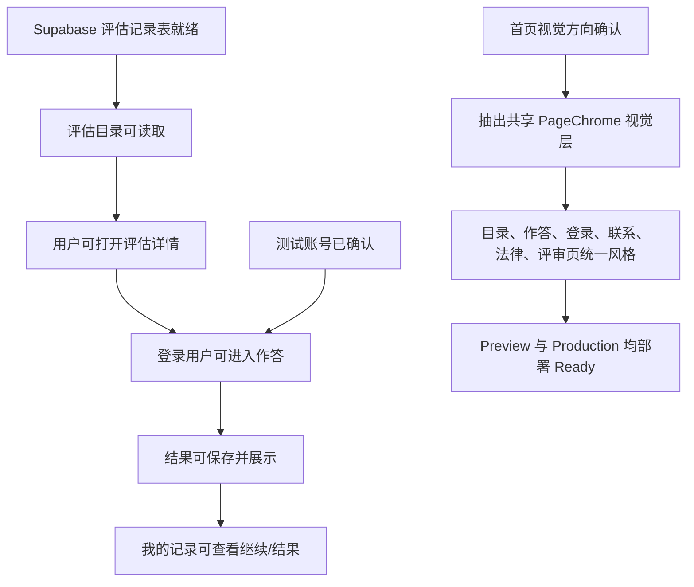

# EQAI 产品工作简报 - 2026-06-07

## 受众与目的

- 受众：产品负责人、项目负责人、评审人员、后续接手的产品与工程协作者。
- 目的：说明今天 EQAI MVP 到达了什么产品状态、如何访问和测试、哪些能力已经验证、还有哪些问题需要继续决策。
- 角色：Briefing pilot。本文区分已确认事实、产品含义、待确认问题和剩余风险。
- 证据边界：基于 2026-06-07 当天的本地源码变更、git 提交、Supabase MCP 验证、Vercel 部署输出、本地测试输出和浏览器/CDP 抽查结果。

## 摘要

今天的工作把 EQAI MVP 从“部分功能已接线的评估原型”，推进到“可以给产品和外部评审使用的生产环境版本”。核心完成项包括：Supabase 评估数据就绪、评估作答与保存结果闭环、登录/我的记录导航修正、页面文案去 demo 化、首页占位图恢复、全站 UI 风格统一、Vercel preview 与 production 部署，以及一个已确认可用的测试账号。

当前可访问地址：

- 生产地址：https://webdeveqai.vercel.app
- 本次生产部署：https://webdeveqai-7hlcq189p-isidoresongs.vercel.app
- 本次预览部署：https://webdeveqai-ow3vi2mhq-isidoresongs.vercel.app

测试登录信息：

- 账号：`test@eqai.com`
- 登录口令：`eqai2026`
- 登录页：https://webdeveqai.vercel.app/zh/login

## 产品状态流



## 今日已完成

### 1. Supabase 与评估数据就绪

今天确认 Supabase MCP 可用，执行并验证了 MVP scale records 相关 SQL。`assessment_scales` 已可读，评估目录和用户作答记录不再只依赖前端占位数据。

产品含义：评估目录、评估详情、用户作答记录已经具备真实数据库基础，可以支撑产品评审里的完整体验。

证据：

- 已执行 `backend/ingestion/mvp_scale_records.sql`。
- 已确认 `assessment_scales` 可读。
- 后续认证 smoke 测试验证了登录用户可以写入评估记录。

### 2. 评估作答闭环完成

今天修复并验证了完整作答路径：

- 评估目录展示 active 评估。
- 评估详情页展示非诊断边界说明。
- 登录用户可以开始评估。
- 用户可以完成 1-7 分题目。
- 点击保存结果后不再卡住。
- 结果页展示总分、平均分、完成时间、答题数量和维度摘要。
- 我的记录页区分 started 和 completed：未完成记录可继续，已完成记录可查看结果。

产品含义：MVP 不再只是“可以浏览评估”，而是可以完成“发现评估 - 登录 - 作答 - 保存 - 查看记录”的闭环。

### 3. 登录与导航体验修正

导航已根据浏览器登录状态切换：

- 未登录时显示“登录”。
- 登录后显示“我的记录”。
- 登录和我的记录不会同时出现。

登录页文案也明确说明：注册使用邮箱确认链接，不是页面验证码。

产品含义：评审者和用户不会再遇到“明明登录了却还看到登录按钮”的信任问题，也能理解注册后为什么需要去邮箱确认。

### 4. 量表内容与语言清理

今天对评估相关内容做了产品化清理：

- 中文页面不再同时混显中英文标题/维度/题目。
- `EQAI` 保持为专用名，不翻译。
- 去除了明显的 demo/test 暗示。
- 详情页不再展示不可作答题目或内部变体。
- 题目数据已足够支撑 MVP 作答流程。

产品含义：页面从工程演示感进一步转向真实产品体验，中文评审时不会被中英文混排干扰。

### 5. 首页占位图恢复

今天根据历史 git 状态和你的反馈恢复了首页中部占位图方向：

- Hero 区保持 `/logo.jpeg`。
- 中部保留 `Mission Image Placeholder`。
- 宽幅 banner 保留 `Wide Banner Image Placeholder`。

产品含义：首页既保留品牌/logo 首屏，又恢复了你需要的正文大占位图位置，后续可替换正式视觉素材。

相关提交：

- `b078acc fix: restore homepage placeholders`
- `53a4b9c Revert "fix: restore hero image placeholder"`

### 6. 全站 UI 风格统一

今天用首页作为视觉基准，把其他页面统一到同一套产品风格：

- 新增 `PageChrome` 共享视觉层。
- 统一了页面外壳、eyebrow 胶囊、柔和卡片、主按钮、次按钮、输入框。
- 页面整体采用首页同源的浅色、柔和渐变、圆角卡片、轻阴影和 primary/teal/lavender/rose 色系。

覆盖页面：

- 评估目录
- 评估详情
- 作答页
- 结果页
- 我的记录
- 登录页
- 联系页
- 关于我们
- 隐私政策
- 服务条款
- 评审页
- work / personal / kid / pet 分类入口页

产品含义：现在全站更像同一个产品，而不是多个阶段拼起来的原型页面。

相关提交：

- `d82f4da style: align pages with homepage design`

### 7. Vercel 部署完成

今天完成了 preview 和 production 两次 Vercel 部署。

生产部署状态：

- Deployment id：`dpl_6TwHhYSxfcEXHPVH1AvuGCaU3Mcd`
- Target：production
- State：Ready
- 主生产地址：https://webdeveqai.vercel.app

产品含义：评审不再依赖本地服务或预览链接，可以直接使用生产地址。

### 8. 测试账号已创建

已创建并验证一个生产可用测试账号：

- 账号：`test@eqai.com`
- 登录口令：`eqai2026`
- 状态：Supabase Auth 用户存在，邮箱已 confirmed，不需要邮件确认。

验证证据：

```json
{
  "ok": true,
  "mode": "login",
  "userId": "f9fc46bc-6d53-48b9-a302-79ab2ecec858",
  "hasSession": true,
  "scaleCode": "MWI",
  "itemCount": 95,
  "attemptId": "28bf2f5a-4a13-433a-81d1-af0460f59fd8",
  "totalScore": 374
}
```

产品含义：评审人员可以不用等待邮箱确认，直接登录、作答、保存结果、查看记录。

## 验证证据

本地验证：

- `npm test`：42 个测试通过。
- `npm run lint`：无 warning / error。
- `npm run build`：通过。
- 本地 production server 对 `/zh` 返回 HTTP 200。
- 使用已有 CDP 浏览器 `127.0.0.1:9230` 抽查：
  - `/zh`
  - `/zh/assessments`
  - `/zh/assessments/MWI`
  - `/zh/login`
  - `/zh/contact`
  - `/zh/review`
- 浏览器抽查结果：
  - 无 `Application error`
  - CSS 正常加载
  - 清理旧本地进程后 console error 为 0
- 移动端 390px 宽度抽查无横向溢出：
  - `/zh/assessments`
  - `/zh/login`
  - `/zh/contact`

生产验证：

- Vercel production deployment 状态为 `Ready`。
- 生产 alias 指向最新 production deployment。
- 测试账号可通过 Supabase Auth 登录，并成功写入/完成一条 `MWI` 评估记录。

## Issues Translated / 工程事实转产品含义

| 工程或来源事实 | 产品含义 | 为什么重要 |
| --- | --- | --- |
| Supabase records SQL 和 seed 数据已启用 | 评估目录和用户记录有真实数据库支撑 | 评审可以测试保存记录的真实流程 |
| 保存结果卡住的问题已修复 | 完成评估后可以到达结果页 | 移除了 MVP 的核心阻塞点 |
| 导航根据 session 切换登录/我的记录 | 用户看到的入口符合当前登录状态 | 降低登录体验里的混乱和不信任 |
| 首页正文占位图恢复，hero 保持 logo | 首页符合当前视觉资产计划 | 避免误把 hero 改回占位图 |
| 引入 `PageChrome` 共享样式 | 多个页面共用一套视觉语言 | 后续调整全站风格更稳定 |
| Vercel production 已 Ready | 团队有稳定公开评审地址 | 外部评审不需要本地环境 |
| 测试账号已 confirmed | 评审可直接登录作答 | 避免被邮箱确认和邮件限流卡住 |

## 推荐评审路径

1. 打开 https://webdeveqai.vercel.app/zh
2. 检查首页 hero 和两个正文占位图。
3. 打开 https://webdeveqai.vercel.app/zh/assessments
4. 进入 `EQAI多维智慧与智力问卷`。
5. 使用测试账号登录。
6. 开始评估，完成题目，保存结果。
7. 打开“我的记录”，确认已完成记录和结果页可访问。
8. 检查联系、隐私、条款、评审页的视觉一致性。

## Open Questions / 待确认问题

- MVP 流程验收后，下一批优先扩展哪个评估模块？
- 评审反馈继续走联系表单，还是需要独立的 reviewer workflow？
- 儿童相关评估的数据同意、监护人流程、保留策略如何定义？
- 生产地址是否继续使用 `webdeveqai.vercel.app`，还是在更大范围评审前接入品牌域名？
- 测试账号是否继续共享使用，还是为每个评审者单独创建账号？

## Remaining Risk / 剩余风险

- 当前测试账号是共享账号，适合评审，不适合长期保存敏感或真实用户数据。
- 公开注册仍依赖 Supabase 邮件发送能力，且今天已遇到 email rate limit。测试账号绕过了评审阻塞，但真实注册体验仍依赖邮件送达。
- Vercel deployment metadata 显示 `gitDirty: 1`，原因是部署时本地存在未跟踪临时文件；源码改动已经提交，这些临时文件未进入 git。
- 当前结果分数适合 MVP 记录和自我参考，不应被表述为正式心理测评解释。
- Production 已上线，但外部评审仍可能提出文案、品牌域名、正式视觉资产等非今日实施范围内的问题。

## 当前交接信息

评审使用：

- 生产地址：https://webdeveqai.vercel.app
- 测试账号：`test@eqai.com`
- 登录口令：`eqai2026`
- 主实现提交：`d82f4da style: align pages with homepage design`

文档关系：

- 英文版：`docs/product-brief-2026-06-07.md`
- 中文版：`docs/product-brief-2026-06-07.zh.md`

